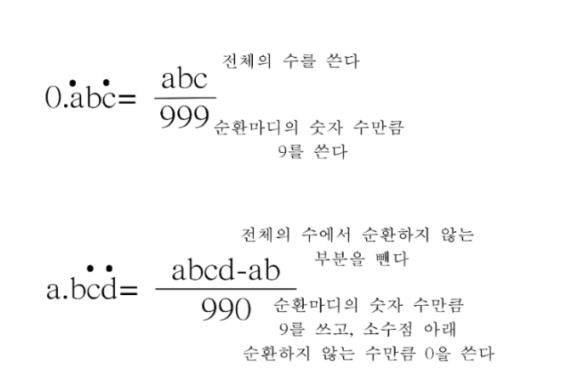

## 📝 문제
<a href="https://boj.kr/5376" target="_blank">문제 링크</a>
<br/><br/>

## 📖 설명
소수를 분수로 변환하는 것은 중학교 수학 과정이다.
 자세한 설명은 <a href="https://m.blog.naver.com/merryhunter/222998550636" target="_blank">출처</a>를 참고하자.  
문제에서 `소수의 첫 두 자리는 "0."이다.`라고 명시되어 있으므로 그림 중 아래 방식을 따라 구현하고 `a = 0`이라고 생각하면 된다. 분모와 분자를 구했다면 유클리드 호제법을 사용해 최대공약수를 구하고 약분한 후 출력 형식에 맞게 출력한다. 계산 과정에서 32비트 정수 범위를 넘어갈 수 있으므로 `long long`을 사용해야 한다.

<br/><br/>

## ⌨️ 코드
```cpp
#include <bits/stdc++.h>
using namespace std;
#define int long long

int gcd(int a, int b) {
    return b ? gcd(b, a % b) : a;
}

signed main() {
    cin.tie(0)->sync_with_stdio(0);
    int t;
    cin >> t;
    while (t--) {
        string s;
        cin >> s;
        s = s.substr(2); // '0.' 제거
        int size = s.size();
        int a, b, g;
        if (s.find('(') == string::npos) { // 유한소수인 경우
            a = stoll(s); // 분모
            b = pow(10, size); // 분자
        } else { // 무한(순환)소수인 경우
            size -= 2;
            int start = s.find('('); // 순환 구간의 시작
            string noRepeat = "0";
            if (start != 0) // 순환 구간 시작이 처음부터가 아니라면
                noRepeat = s.substr(0, start); // 순환하지 않는 구간을 저장
            string repeat = s.substr(start + 1, size - start); // 순환 구간을 저장
            a = stoll(noRepeat + repeat) - stoll(noRepeat); // 공식에 따라 분모
			// 공식에 따라 분자
            string tmp = "";
            for (int i = 0; i < size - start; i++)
                tmp += '9';
            for (int i = 0; i < start; i++)
                tmp += '0';
            b = stoll(tmp);
        }
        g = gcd(a, b); // 분모와 분자의 최대공약수
        cout << a / g << '/' << b / g << '\n';
    }
}
```

```toc
```