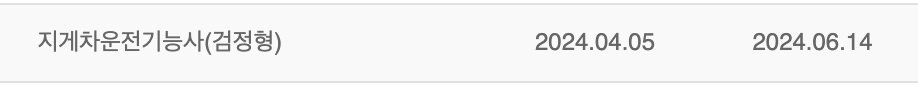

<br/>

## 📎 지게차운전기능사 자격증을 따게 된 이유

2023년 10월에 입대하고 11월에 자대, 12월에 파견지로 갔다. 이제 적응 좀 할 무렵인 1월말 즈음에 2024 전반기 국가기술자격검정(국기검) 원서 접수를 받고 있길래 쉽게 딸 수 있고 인기 많다는 지게차운전기능사 원서를 접수했다.
<br/><br/>

## 📚 2024년 전반기 지게차운전기능사 필기 시험
### 1. 필기 시험 준비
접수는 1월 말에 되었지만 필기 시험은 3월 23일이었다. 실제로 공부를 시작한 것은 시험 2주 전 쯤에 생활관 동기가 사놓고 안보던 책을 빌려 문제를 풀어보며 공부했다. 시험 3일 전부터는 모바일 앱을 설치해서 기출 위주로 돌려봤다. 아이폰이여서 '기출문제'라는 앱을 사용했다.
<br/><br/>

### 2. 필기 시험 후기
필기 시험은 자대가 부산지역이라 김해에서 봤다. 아무래도 공부를 열심히 하진 않아서 모르는 문제도 있었지만 아는 문제 위주로 그럴싸한 답변 위주로 체크했더니 52/60 정답률로 합격했다. 실린더 관련 과목에서 열이 올라가면 부피가 커지는 것 같은 상식 위주로 생각해서 문제를 풀었더니 결과가 괜찮았던 것 같다. 필기 시험 결과는 4월 5일에 나왔다.
<br/><br/>

## 🛞 2024년 전반기 지게차운전기능사 실기 시험
### 1. 실기 시험 준비
필기 시험 결과가 나오고 약 한 달 뒤 쯤 실기시험 일정이 나왔다. 실기시험은 6월 3일 ~ 5일까지 3일간 타 부대에 파견 형식으로 가서 집체교육을 받고 시험까지 치고 오는 것이다. 실기 시험은 준비할 수 있는 것이 딱히 없었다. 집체교육이 이뤄지기 때문에 가서 배운다는 마인드였다. 그래도 이동하면서 유튜브 영상 한두번은 봤다. 집체교육 부대로 이동하여 공장 창고 같은 건물에서 2박3일을 지냈다. 1일차 오후부터 2일차까지 지게차를 직접 타고 코스를 돌며 연습을 하고 3일차는 오전부터 시험을 봤다.
<br/><br/>
1일차에는 2번, 2일차에는 총 5번 지게차에 탑승하여 코스를 주행했다. 지게차가 전륜 구동에 후륜 조향이다 보니 자동차와 느낌이 많이 달랐다. 핸들도 많이 가볍고 조향 바퀴도 거의 90도까지 돌아가서 처음엔 좀 어색한 감이 있었다. 여러번 타고 주행하다보니 요령도 늘고 어느 지점에서 어느 정도 간격으로 들어가서 조향을 해야하고 언제 엑셀을 밟아서 시간을 단축할 수 있는지 등을 숙달했다. 처음엔 3분30초 정도의 기록이 나중엔 2분대까지도 들어올 정도로 연습이 됐다.
<br/><br/>

### 2. 실기 시험 후기
30여명 중에 23번째로 시험을 보게 되어서 앉아서 딴짓이나 하고 있었다. 불려나가서 시험을 봤고 3분 초반대로 여유있게 합격했다. 다른 교육생들 중 간격 조절을 못해서 선을 밟고 실격하는 사람도 있었고, 주행하기 전에 포크를 내려야 하는데 이를 내리지 않아 실격한 사람도 더러 있었다. 주의할 점만 주의하면 누구나 딸 수 있을 만큼 정말 쉬운 자격증이라고 생각한다.
<br/><br/>

## 🌟 지게차운전기능사 합격 후기
시험을 쳤을 때 실수가 없었고 평소에도 시간이 널널했기에 합격할 것이라고 생각했고 과정을 지켜본 교관님께서도 잘했다고 칭찬해주셨기에 결과 발표일만 기다리고 있었다. 그리고 6월 14일 합격 글자를 볼 수 있었다. 군 생활 중 국가기술자격검정(국기검) 기회가 보통 2회 정도 있는데 한 번 쯤은 해도 좋을 것 같다. 무엇보다 공짜여서 사회에선 비싼 돈을 주고 들어야 하는 교육을 무료로 들을 수 있는 점이 가장 큰 메리트인 것 같다. 군에서 자격증 하나 따고 싶은데 공부를 깊이 하고 싶지 않다면 지게차운전기능사 취득을 고려해 보는 것도 나쁘지 않은 것 같다.

```toc
```